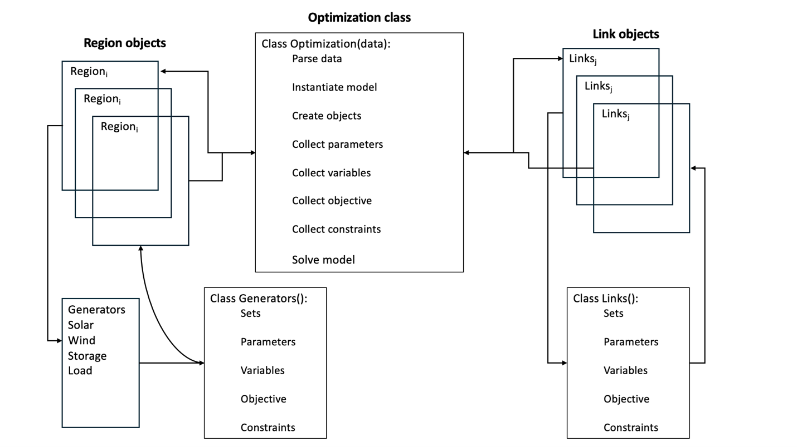

# GOOD Model Documentation

## Table of Contents
1. [Background](#background)
2. [Data](#data)
3. [Model Structure](#model-structure)
4. [Mathematical Formulation](#mathematical-formulation)

## Background

Click to expand!

The Grid Optimized Operation Dispatch (GOOD) model was developed by Prof. Alan Jenn to investigate the impact of transportation electrification policies on the electric grid. The first version of the GOOD model relied on a combination of R (pre- and post-processing data) and GAMS (optimization). The present version is open source leveraging Python’s object-oriented programming structure and host of third-party libraries. The model uses Pyomo, a Python optimization package enabling LP, MIP, NLP, and a variety of other problem types.

### Purpose & Target User Group
The model is intended for researchers and policy makers to assess the impact of transportation decarbonization policies on the electric grid. It enables to conduct independent analysis within common modeling framework and shared data inputs to better evaluate the outcomes of different policy approaches.

### Prior Work & Use
The model has been used by Prof. Alan Jenn in prior work, including:

- Alan Jenn. "Emissions of electric vehicles in California's transition to carbon neutrality." Applied Energy. (2023). [DOI](https://doi.org/10.1016/j.apenergy.2023.120974)
- Wanshi Hong, Alan Jenn, and Bin Wang. "Electrified autonomous freight benefit analysis on fleet, infrastructure and grid leveraging Grid-Electrified Mobility (GEM) model.” Applied Energy. (2023) [DOI](https://doi.org/10.1016/j.apenergy.2023.120760)
- Yanning Li, Xinwei Li, and Alan Jenn. "Evaluating the emission benefits of shared autonomous electric vehicle fleets: A case study in California." Applied Energy. (2022). [DOI](https://doi.org/10.1016/j.apenergy.2022.119638)
- Fan Tong, Derek Wolfson, Alan Jenn, Corinne D. Scown, and Maximilian Auffhammer. "Energy consumption and charging load profiles from long-haul truck electrification in the United States." Environmental Research: Infrastructure and Sustainability 1, no. 2 (2021). [DOI](https://doi.org/10.1088/2634-4505/ac186a)
- Fan Tong, Alan Jenn, Derek Wolfson, Corrine Scown, Maximilian Auffhammer. “Health and Climate Impacts from Long-Haul Truck Electrification.” Environmental Science & Technology. (2021). [DOI](https://doi.org/10.1021/acs.est.1c01273)
- Colin JR Sheppard, Alan T. Jenn, Jeffery Buyers Greenblatt, Gordon S. Bauer, and Brian F. Gerke. “Private Versus Shared, Automated Electric Vehicles for US Personal Mobility: Energy Use, Greenhouse Gas Emissions, Grid Integration and Cost Impacts.” Environmental Science & Technology. (2021). [DOI](https://doi.org/10.1021/acs.est.0c06655)
- Alan Jenn, Kyle Clark-Sutton, Michael P. Gallaher, and Jeffrey Petrusa. “Environmental impacts of extreme fast charging.” Environmental Research Letters. (2020). [DOI](https://doi.org/10.1088/1748-9326/ab9870)
- Colin JR Sheppard, Gordon S. Bauer, Brian F. Gerke, Jeffery B. Greenblatt, Alan T. Jenn, and Anand R. Gopal. “A joint optimization scheme for the planning and operations of shared, autonomous, electric vehicle fleets serving mobility on demand”. Transportation Research Record (2019), pp. 1–19. [DOI](https://doi.org/10.1177/0361198119838270)

## Data

Click to expand!

### Data Sources

The model leverages data from the Environmental Protection Agency’s (EPA) [Emissions & Generation Integrated Database (eGRID)](https://www.epa.gov/egrid), [National Electric Energy Data System (NEEDS)](https://www.epa.gov/power-sector-modeling/national-electric-energy-data-system-needs) database, and [Power Sector Modeling Platform Using IPM](https://www.epa.gov/power-sector-modeling/2023-reference-case). The databases provide the portfolio of generators, their corresponding emission factors, and the capacity and cost of different generation resources for capacity expansion planning. Most of the input parameters are contained within eGRID and NEEDS.

#### eGRID
There is one input from eGRID: power plant characteristics.

**File: egrid2020_data_plants.csv**

This file contains attribute information about power plants in the US. Location information of interest includes:
- `UTLSRVNM` = utility
- `NERC` = NERC region
- `SUBRGN` = NEMS region
- `FIPSST` = State (FIPS code)
- `FIPSCNTY` = County (FIPS code)
- `LAT` = Latitude coordinates
- `LON` = Longitude coordinates
- `PLPRMFL` = Primary fuel
- `PLNOXRTA` = Annual emissions rate of NOx [lb/MWh]
- `PLSO2RTA` = Annual emissions rate of SO2 [lb/MWh]
- `PLCO2RTA` = Annual emissions rate of CO2 [lb/MWh]
- `PLCH4RTA` = Annual emissions rate of CH4 [lb/MWh]
- `PLN2ORTA` = Annual emissions rate of N2O [lb/MWh]

#### NEEDS
There are two primary files for NEEDS: power plant characteristics by IPM region and inter-IPM region transmission capacity and cost.

**File: needs_v617_parsed.csv**

This file contains attribute information about power plants in the US including:
- `RegionName` = IPM region
- `StateName` = State
- `CountyName` = County
- `PlantType` = Plant Type
- `FuelType` = Fuel Type
- `FossilUnit` = Indicator for fossil plant
- `Capacity` = Plant power capacity [MW]
- `Firing` = Type of firing system in coal plants
- `Bottom` = Type of bottom ash in coal plants
- `EMFControls` = Emission factor controls in coal plants
- `FuelCostTotal` = Annual cost of fuel [$]
- `FuelUsedTotal` = Annual volume of fuel used [MMBtu]
- `VOMCostTotal` = Cost of variable operations and maintenance [$/MWh]

Firing, Bottom, and EMFControls are necessary to pair with a separate dataset to get an approximation of the particulate emissions from coal plants.

The eGrid and NEEDS files can be merged via the ORISPL (in eGRID) and ORISCode (in NEEDS) columns, referring to the ORIS ID that is a standardized index for power plants in the United States.

**File: needs_v6_transmission.csv**

This file contains all information related to the parameters *ctransCost* and *ctransCap*. All combination of regions that have some capacity or transmission tariff (wheeling costs) are contained within this file. One important thing to note is that the transmission values are not symmetrical, capacity in one direction does not necessarily mean that the same capacity exists in the other direction.

### Data Parsing

#### Understanding fuel types
There are several different columns across the two datasets that provide indicators for what type of fuel a power plant uses to generate electricity. This isn’t entirely straightforward because a power plant can have multiple units or generators, and they may not always use the same fuel. For example, you could have a coal plant that has an oil generator backup (since this can be used to provide on-site power, or to even assist in the startup of the primary boiler). For the most part, the PLPRMFL provides the best sense of this, as it designates the dominant fuel as the primary fuel type for a power plant. However, there are sometimes reporting exemptions for power plants under a certain size, or if they have been exempted from emissions reporting through legacy policies - leading to a few instances of blank fuel types in the eGRID dataset. We can fix these by examining the plant categories in the NEEDS dataset and parsing in the correct fuel type. 

#### Fixing fuel costs
For all thermal generators, fuel costs (‘dispatch costs’) are not directly included within the dataset. They are calculated by combining total annual fuel cost, total annual fuel used, and heat rate to produce a cost per MWh.

%5Ctimes%7BHeatRate%7D)

The fuel costs are further modified to account for generators with $0 fuel costs. First, for simplicity, we set the fuel costs of hydro and pumped storage to 0 and aim to modify constraints on water supply directly through constraints. Second, fossil plants that have reported costs of \$0 for their fuel supply we assign costs of fuel equal to the average cost of the same fuel within the same IPM region (accounting for inter-regional variability in fuel costs). Fuel costs are assigned by sampling the distribution of costs from neighboring regions for the same generator type and mapping the distribution sample to the $0 generators. The sample is grouped by location, generator type, and plant capacity to capture differences in costs due to capacities (e.g., economies of scale). This approach ensures the economic dispatch operation of the model is tied more closely to capacity of plants. If the sampling did not include capacity, then high capacity, $0 generators may have a low-capacity generator cost applied, which would not accurately reflect the different operating conditions due to capacity. 

#### Fixing emission rates
Many non-combustion plants have reported emission rates in the eGRID dataset typically due to on-site backup generators. To simplify, the emissions are simply set to 0 for these generators. For fossil plants that do not have information on emission rates, we set emissions to be equivalent to the average plant of the same fuel type with a similar overall capacity and heat rate.

**File: c01s01.pdf - c01s11.pdf**
These series of files provide information on particulate emission rates of different types of plants and allow us to supplement the emissions rates tracked by eGRID with additional information on condensable PM emissions rates. Each .pdf file contains information on the emissions associated with corresponding fuel types, broken down by specific attributes of each generator. The modifications look something like:

#### Aggregating generators
The raw data includes ~19,000 generators across the IPM regions. Including all generators in the model would cause the model to grow exponentially in size and become intractable to solve. To correct this, the generators are aggregated by IPM region grouped around heat rate, emissions rate, and fuel cost. In order retain model fidelity, generators are not aggregated into a single unit or type; for example, all combined cycle natural generators are combined into a single unit within the region. Prior model versions have settled around 5,000 generators across all US IPM regions as the appropriate amount of ensure model tractability and fidelity of results. 

Presently, the raw data is condensed to 5,000 generators by creating a node-link graph from each IPM region where each generator is a node and assigning the heat rate, emissions rate, and cost as node characteristics. In general, this approach applies k-means clustering to a graph.  Within the link component,  the ‘distance’ or difference between each nodal element is calculated between the source and target. Next, a weighted distance (difference) function is used to compose all the nodal characteristics into a single metric – ‘weighted distance’. The weighted distance is, 

where *w1*, *w2*, and *w3* are equal to 1. The links are filtered by setting the maximum ‘distance’ or difference for each metric (emissions rate = 2,000; heat rate = 2,000; fuel costs = 10). The filtering enables a user to flexibly set the limits for which generators should be linked together in each graph. Once the links are filtered, the communities are found using the weighted distance values calculated; communities are groupings of nodes like clusters of data points used in traditional k-means analysis. The communities are found using the networkx.greedy_modularity_communities where weight is set the ‘weighted_distance’. The weighting determines which links should be prioritized when identifying a community. Thus, if the weights (*w1*, *w2*, and *w3*) are changed then a community will be formed that reflects either emissions rate, heat rate, or fuel cost more. For example, if a user wants is performing a model run that requires more specific emissions results, they will decrease the weight placed emissions rate as the exponential decay function will minimize the impact of higher weights and increase the impact of lower weights. The number of communities can be adjusted by changing the resolution. To reached ~5,000 generators, the resolution is set to 1.1. 

#### Power Sector Modeling Platform
The Power Sector Modeling Platform provides multiple datasets: 

- **File: Table 4-39 Wind Generation Profiles in EPA Platform v6.csv**
This file contains capacity factor information for wind turbines in kWh generation per MW of capacity. This information is broken down by IPM region, resource group, month, day of the month, and hour. This provides information on c^windCF.
- **File: table_2-2_load_duration_curves_used_in_epa_platform_v6.csv**
This file contains information on the demand loads in each IPM region, broken down by month, day, and hour of the year. This provides information on c^demandLoad.
- **File: table_4-38_onshore_regional_potential_wind_capacity_mw_by_trg_and_cost_class_in_epa_platform_v6.csv**
This file contains information on the maximum available wind resource (MW) broken down by IPM region, resource group, and cost class. This provides information on c^windMax.
- **File: table_4-40_capital_cost_adder_for_new_onshore_wind_plants_in_epa_platform_v6.csv**
This file contains information on the capital cost of installing new wind resources ($/MW) broken down by IPM region, resource group, and cost class. This provides information on c^windCost.
- **File: table_4-41_solar_photovoltaic_regional_potential_capacity_mw_by_resource_and_cost_class_in_epa_platform_v6.csv**
This file contains information on the maximum available source resource (MW) broken down by IPM region, resource group, and cost class. This provides information on c^solarMax.
- **File: table_4-43_solar_photovoltaic_generation_profiles_in_epa_platform_v6.csv**
This file contains capacity factor information for solar PV in kWh generation per MW of capacity. This information is broken down by IPM region, resource group, month, day of the month, and hour. This provides information on c^solarCF.
- **File: table_4-44_capital_cost_adder_for_new_solar_pv_plants_in_epa_platform_v6.csv**
This file contains information on the capital cost of installing new solar resources ($/MW) broken down by IPM region, resource group, and cost class. This provides information on c^solarCost.
- **File: Table 3-23 State Power Regulations included in EPA Platform v6.pdf**
This file contains state-level regulations that provide guidance for formation of constraints that allow for the GOOD model to reflect restrictions on operations of power generation units throughout the country. Different constraints are likely needed to capture the variety of regulations.

## Model Structure

Click to expand!

The GOOD Model leverages the object-oriented structure of Python. Using Pyomo, the model reflects the mathematical formulation—sets, parameters, variables, objectives, and constraints—as Pyomo objects. The model will still utilize Pyomo components—sets, parameters, variables, objective, and constraints. Importantly, all Pyomo does is write a `.lp` file that is passed to a solver (i.e., CBC, Gurobi, HiGHS, etc.). The solver is the component which finds the optimal solution while Pyomo serves as the interface to it. Solvers are either free (CBC, GLPK, HiGHS) or require a commercial license (Gurobi). As this model intends to be open source, it will use a free solver. If a user has access to a commercial solver, they can easily insert it into the model.

### Data Input Pre-processing
Dependencies:
- `pandas`
- `numpy`
- `networkx`
- `json`

### Optimization
Modules:
- `opt_model.py`
- `RegionNode.py`
- `Generator.py`
- `Solar.py`
- `Wind.py`
- `Storage.py`
- `Load.py`
- `Transmission.py`

Dependencies:
- `Pyomo`

The model structure reflects a node-link graph where the nodes are each region, and the links are the transmission lines connecting the regions. Structuring the model as a graph better reflects the physical architecture of the electric grid, and it more easily enables the use of Python objects. The model includes seven objects stored within a similarly named module:

- `RegionNodes`
- `Transmission`
- `Generators`
- `Solar`
- `Wind`
- `Storage`
- `Load`

The objects are accessed by the optimization module (`opt_model.py`). The class parses the data, instantiates the model, creates the region and transmission objects, collects the parameters, variables, objectives, and constraints created in the objects, solves the model, and returns the results (Figure 1).

RegionNodes and Transmission are the primary objects through which the other objects are accessed. Mirroring the mathematical formulation and the physical representation of the grid, each region hosts generators, solar, wind, storage, and load. Pyomo model components (sets, parameters, variables, objective, constraints) are created for each RegionNode by the corresponding object – Generator, Solar, Wind, Storage, or Load. For example, the Generator class handles the generator capacity and cost data translating each into parameters, the generation decision variable, the generation term for the objective function, and generation-specific constraints. A similar process is completed for the Link objects.

Generalizing the model attributes in this way enables more flexible and extensible modeling for future needs. For instance, a user could model specific managed charging approaches or other demand response strategies by adjusting data inputs to the Load class or add a completely new object to handle load modification. Either change could be implemented without significantly impacting other parts of the model. 

### Diagnostics
Module:
- `diagnostics.py`

Dependencies:
- `pandas`
- `numpy`
- `matplotlib.pyplot`
- `seaborn`

To validate the model, there are four diagnostic metrics used to compare baseline outputs:
- Total kWh generated
- Total CO2e emitted
- Annual fuel mix
- Supply-demand balancing

The metrics used 2021 data as the baseline from eGRID and NEEDs. The diagnostics metrics are found on [Historical eGRID Data](https://www.epa.gov/egrid/historical-egrid-data):
- Total kWh generated: Summary Tables (xlsx) Table 2
- Total CO2e emitted: Summary Tables (xlsx) Table 1 & Table 2
- Annual fuel mix: Summary Tables (xlsx) Table 2, row 31 ('Generation Resource Mix (percent)')

### Results Processing
Modules:
- `opt_model.py`

Dependencies:
- `matplotlib.pyplot`
- `plotly`
- `pandas`

Model results are generated in the `results()` function within each object—`Generator`, `Solar`, `Wind`, `Storage`, and `Transmissions`. `RegionNode` calls the `results()` function for the region-specific objects. All results are gathered within `opt_model` and appended to the node-link graph data input. Results are accessed via `<variable_assigned_to_model>.results[<region_name>]`.

To enable ease of analysis and use, the module generates the raw results as a `.csv` or `.json` and provides a series of summary plots that can be directly included in a report and examined locally using `plotly` via `streamlit`. The module allows the user to return all plots by region, balancing authority, or state. The default plots display results nationally. The plots included:
- Generation mix
	- Hourly mix as a stacked line plot
	- Annual mix by region as a stacked bar chart
- Emissions rate
	- Hourly mix as a stacked line plot
	- Annual mix by region as stacked bar chart
	- Annual CO2e by region as a shaded map
- Stationary storage operating curve
	- Charged & discharge curve as a line chart by region
- Map of new solar and wind capacity
	- Circles mapped to region varied by size to reflect built capacity

## Mathematical Formulation

Click to expand!

The mathematical formulation is defined in part by the input data; however, it still reflects still reflects the node-link graph that form the basis of the code structure. There is some balance to this as we think about the generalizability of the model versus what is dictated by the data, we are using so keep this in mind as you consider the model.

### 4.1 Sets

- *g*: Set of all generators. {n~103}
	- *hydro*: A subset of *g*, representing the set of hydroelectric generators.
- *wrc*: Wind resource classes. {n~101}
- *src*: Solar resource classes. {n~101}
- *cc*: Cost classes.
- *t*: Time periods represented in the model, defaulting to hourly. {n~103}
- *r*: Set of regions used in the model, defaulting to IPM regions in most versions. {n~102}
	- *o*, *p*: Alias set of *r*, used for bookkeeping purposes when you need to use the same sets more than once in a single equation (i.e., for transmission when you need to represent "from" and "to").

Importantly, *r* is represented as each RegionNode object and is not used as a typical index set. Instead, region-specific parameters, decision variables, objective terms, and constraints are created. The pyomo object names contain each region name. For example, the generation decision variable is names model.[r]\_generation where r is the name of the IPM region. When reviewing the parameters, objective function, and constraints, *r* should be interpreted as an object whereas all other sets can be interpreted as traditional sets.

*wrc* and *src* reflect the quality –  “really good”, “good”, “okay”, “somewhat bad”, “really bad” and amount of solar irradiation and wind resources. The input data provide distinctions for capacity factors, costs of generation, and transmission costs for different classes of these resources in each of the regions, thus giving much more accurate representation of renewable resources.

Within the model, the sets are represented as the model object name – *model* – followed by the set name. For example, the time set is *model.t*. 

There are several additional sets that can be incorporated depending on the scenario needs: 

- *d*: different set of time periods represented in the model, defaulting to daily. This has been primarily used to represent constraints for charge management where EV load demands have to be fulfilled at a daily level. (this is one area to think about carefully when generalizing) {n~102}
- *s*: set of regions used in the model corresponding to states (usually for policy constraints) {n~102}
- *gtorg,r*: 2-dimensional set mapping generators *g* to regions *r*
- *gtosg,s*: 2-dimensional set mapping generators *g* to states *s*
- *ttodt,d*: 2-dimensional set mapping time period (hours) *t* to time period (days) *d*

### 4.2 Parameters

- *cr,ggenCost*: the cost to generate a unit of power from generator *g* in region *r* [$/MW]
- *cr,ggenMax*: the maximum generation capacity of generator *g* in region *r* [MW]

#### Transmission:
- *cr,otransCost*: the wheeling costs associated with transmitting power from region *r* to region *o* [$/MW]
- *cr,otransCap*: the maximum transmission capacity between regions *r* and *o* [MW]
- *ctransLoss*: the losses associated with transmitting power between regions; in this model, it is fixed regardless of distance [unitless fraction]

#### Solar:
- *cr,srcsolarCap*: the existing capacity of solar generation of a specific resource class *src* in region *r* [MW]
- *cr,srcsolarMax*: the maximum solar capacity of specific resource class *src* and cost class *cc* in region *r* [MW]
- *cr,src,ccsolarCost*: the cost of new solar capacity of specific resource class *src* in region *r* [$/MW]
- *cr,src,tsolarCF*: the capacity factor of solar generators of a specific resource class *src* in region *r* in a given time period *t* [unitless fraction]
- *cr,srcsolarTransCost*: the cost to build transmission for new solar capacity of a specific resource class *src* in region *r* [$/MW]

#### Wind:
- *cr,wrcwindCap*: the existing capacity of wind generation of a specific resource class *wrc* in region *r* [MW]
- *cr,wrc,ccwindMax*: the maximum wind capacity of specific resource class *wrc* and cost class *cc* in region *r* [MW]
- *cr,wrc,ccwindCost*: the cost of new wind capacity of specific resource class *wrc* and cost class *cc* in region *r* [$/MW]
- *cr,wrc,twindCF*: the capacity factor of wind generators of a specific resource class *wrc* in region *r* in a given time period *t* [unitless fraction]
- *cr,wrcwindTransCost*: the cost to build transmission for new wind capacity of a specific resource class *wrc* in region *r* [$/MW]

#### Storage:
- *crstorCap*: the maximum storage capacity of storage assets in region *r* [MWh]
- *cstorLoss*: the roundtrip efficiency of energy going through storage [unitless fraction]
- *cstorFlowCap*: the maximum amount of power relative to its capacity that storage can either charge or discharge [unitless fraction]

#### Load:
- *cr,tdemandLoad*: the baseload demand for energy in region *r* in time period *t* [MWh]
- *cr,tevLoad*: the demand from charging EVs in region *r* in time period *t* [MWh]
- *cr,devFixedLoad*: the aggregate daily demand from charging EVs in region *r* over time period *d* [MWh]

#### Policy:
- *crRPS*: the Renewable Portfolio Standard requirements for renewable generation in a given year in region *r* [unitless fraction]
- *csimportLimit*: the maximum import of electricity into a specific state [MWh]
- *cspollutionLimit* (placeholder for cross-state pollution): the maximum limit of pollution emitted in region *s* (can represent multiple pollutants if needed - another index would be needed probably) [mass]

### Decision Variables
- *xr,g,tgen*: for each generator *g*, this variable determines how much energy is being produced in each time period *t* in region *r*. The units are technically Megawatts [MW] but, conveniently when *t* is defined as an hourly period, the amount *xgen* also represents the energy produced in that time period [MWh] (since you are multiplying by 1 hour).
- *xr,o,ttrans*: this variable tells us the power being sent in a transmission line from region *r* to region *o* during time period *t* [MW].
- *xr,src,ccsolarNew*: the amount of new solar generation capacity to add of a specific solar resource class *src* in region *r* [MW].
- *xr,wrc,ccwindNew*: the amount of new wind generation capacity to add of a specific wind resource class *wrc* in region *r* [MW].
- *xr,tstorSOC*: the aggregate state-of-charge of storage in a region *r* in time period *t* [MWh].
- *xr,tstorCharge*: the amount of power from the grid used to charge storage in region *r* in time period *t* [MW].
- *xr,tstorDischarge*: the amount of power discharged by storage to the grid in region *r* in time period *t* [MW].

Possible additions:

- *xr,tevLoad*: the charging demand from electric vehicles in a region *r* in time period *t*. This is only a decision variable in scenarios where we allow an operator to do managed charging (hence controlling the total load that the grid must satisfy) - otherwise, this variable would be represented as a fixed parameter (when smart charging is "turned off") [MW].
- V2G representation: More nuanced storage representation (instead of aggregating storage within a region, hence assuming uniformity of the storage resource) - but this could dramatically increase computational complexity.

### Objective Function

This objective function minimizes the cost to operate (dispatch) and build out (capacity expansion) of the bulk power system.

%7D%7D%7D&plus;%5Csum_r%7B%5Csum_%7Bwrc%7D%7B%5Csum_%7Bcc%7D%7Bx%5E%7BwindCost%7D_%7Br,wrc,cc%7D%5Cleft(c%5E%7BwindCost%7D_%7Br,wrc,cc%7D&plus;c%5E%7BwindTransCost%7D_%7Br,wrc%7D%5Cright)%7D%7D%7D)

There are two key items to note: 
- Set *r* is present within the formulation, but is not directly present the code as described in 4.1
- Dispatch and capacity are going to be in vastly different units - but at the end of the day solar capacity only really cares about its comparative cost to wind capacity (due to the constraints we use later on).

Additional components can be added to the objective to model different policy scenarios, load modification schemes, such as EV V2G, and potentially other elements provided they are related to EVs and transportation electrification: 
- Carbon pricing
- Pollution pricing (data is available for this)
- Economic capacity expansion
	- Storage capacity costs
- EV V2G generation - may not necessarily belong in the objective function (depending on how we want to set things up)
- New transmission capacity

### Constraints
All constraints applied in the model.

#### Energy Balance

c%5E%7BsolarCF%7D_%7Br,src,t%7D&plus;%5C%5C%5Csum_%7Br%7D%5Csum_%7Bwrc%7D%5Csum_%7Bcc%7D(x%5E%7BwindNew%7D_%7Br,wrc,cc%7D&plus;c%5E%7BwindCap%7D_%7Br,wrc,cc%7D)c%5E%7BwindCF%7D_%7Br,wrc,t%7D&plus;%5Csum_%7Bo%7D%5Csum_%7Br%7D%5Csum_%7Bt%7Dx%5E%7Btrans%7D_%7Br,o,t%7Dc%5E%7BtransLoss%7D%5C%5C-%5Csum_%7Br%7D%5Csum_%7Bp%7D%5Csum_%7Bt%7Dx%5E%7Btrans%7D_%7Br,t,p%7D-%5Csum_%7Br%7D%5Csum_%7Bt%7Dc%5E%7Bload%7D_%7Br,t%7D%5Cge%200%5C;%5Cforall%5C;(r,t))

This constraint forces generation to (at least) match load. Dispatchable generation is fairly straightforward and represented by *xgen*. Renewable resources are automatically dispatched based on their capacity and corresponding capacity factors. Lastly, transmission is handled by two terms relative to region “r”: everything going into *r* is represented by the *xr,o,ttrans* term and everything going out of *r* is represented by the *xr,p,ttrans* term. Demand is divided into baseload demand and EV charging demand, both of which are fixed over the course of a full year.

##### Energy Balance (Smart Charging)

c%5E%7BsolarCF%7D_%7Br,src,t%7D&plus;%5C%5C%5Csum_%7Br%7D%5Csum_%7Bwrc%7D%5Csum_%7Bcc%7D(x%5E%7BwindNew%7D_%7Br,wrc,cc%7D&plus;c%5E%7BwindCap%7D_%7Br,wrc,cc%7D)c%5E%7BwindCF%7D_%7Br,wrc,t%7D&plus;%5Csum_%7Bo%7D%5Csum_%7Br%7D%5Csum_%7Bt%7Dx%5E%7Btrans%7D_%7Br,o,t%7Dc%5E%7BtransLoss%7D%5C%5C-%5Csum_%7Br%7D%5Csum_%7Bp%7D%5Csum_%7Bt%7Dx%5E%7Btrans%7D_%7Br,t,p%7D-%5Csum_%7Br%7D%5Csum_%7Bt%7D%5Cleft(c%5E%7Bload%7D_%7Br,t%7D&plus;x%5E%7BevLoad%7D_%7Br,t%7D%5Cright)%5Cge%200%5C;%5Cforall%5C;(r,t))

This constraint is an alternative scenario to the original Energy Balance Constraint, the only difference being that the charging demand term is no longer fixed and is instead represented as a decision variable. This means that the operator can adjust the demand to best meet the requirements of the grid.

##### Energy Balance (EV Load)

)

To ensure that some aggregate charging load is met, this constraint requires that the total daily load is fulfilled in situations where managed charging happens (i.e. Energy Balance alternate)--this is what prevents the operator from simply choosing not to charge any of the vehicles and setting *xevLoad* to 0. More nuances can be added to this constraint: e.g., further constraints on charging times from travel behavior, etc.

#### Generator Capacity

)

This constraint prevents power plants from producing more power than the rated capacity of the generator.

#### Storage
##### Storage Capacity

)

This constraint prevents storage units from storing more energy than the rated capacity of the storage system.

##### Storage State-of-Charge

)

This constraint balances the storage state-of-charge in each time period. It states that the SOC can be calculated by taking the previous time period’s SOC, adding the energy from charging the battery and subtracting the energy discharged from the battery in the same time period. Note that the storage will never choose to charge/discharge at the same time due to the roundtrip efficiency loss (which will ultimately increase the cost in the objective function).

##### Storage Flow Limits (Charging)

)

This constraint prevents storage units from charging faster than their max charge rate.

##### Storage Flow Limits (Discharging)

)

This constraint prevents storage units from discharging faster than their max discharge rate.

#### Renewable Resource Capacity

)

This constraint prevents more solar capacity being built than a given region can host. 

)

This constraint prevents more wind capacity being built than a given region can host. 

#### Policy Constraints
##### Renewable Portfolio Standards

c%5E%7BsolarCF%7D_%7Br,t,src%7D&plus;%5Cleft(x%5E%7BwindNew%7D_%7Br,src%7D&plus;c%5E%7BwindCap%7D_%7Br,src%7D%5Cright)c%5E%7BwindCF%7D_%7Br,t,src%7D%5Cright)%7D%7D%7D-c%5E%7BRPS%7D_%7Br%7D%5Csum_%7Bt%7D%7B%5Csum_%7Bg%5Cepsilon%20gtor_%7Bg,r%7D%7D%7Bx%5E%7Bgen%7D_%7Bg,t%7D%7D%7D%5Cge0;%5Cforall%20r)

This is an important constraint for capacity expansion (non-economic based). This accounts for state-level RPS policies that require a certain percentage (*cRPS*) of total generation to come from renewable sources. Constraint is not presently included in the model.

##### Electricity Imports

Some states have limits on electricity imports (especially for RPS), which we can represent with this constraint. This constraint is not presently included in the model.

